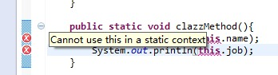
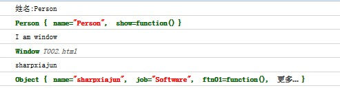

> 转载自伯乐在线http://blog.jobbole.com/81018/

讲解this指针的原理是个很复杂的问题，如果我们从javascript里this的实现机制来说明this，很多朋友可能会越来越糊涂，因此本篇打算换一个思路从应用的角度来讲解this指针，从这个角度理解this指针更加有现实意义。

下面我们看看在java语言里是如何使用this指针的，代码如下：


public class Person {
    
    private String name;
    private String sex;
    private int age;
    private String job;

    public Person(String name, String sex, int age, String job) {
        super();
        this.name = name;
        this.sex = sex;
        this.age = age;
        this.job = job;
    }

    private void showPerson(){
        System.out.println("姓名：" + this.name);
        System.out.println("性别：" + this.sex);
        System.out.println("年龄：" + this.age);
        System.out.println("工作：" + this.job);
    }

    public void printInfo(){
        this.showPerson();
    }
    
    public static void main(String[] args) {
        Person person = new Person("马云", "男", 46, "董事长");
        person.printInfo();
    }

}

//姓名：马云
//性别：男
//年龄：46
//工作：董事长


上面的代码执行后没有任何问题，下面我修改下这个代码，加一个静态的方法，静态方法里使用this指针调用类里的属性，如下图所示：

我们发现IDE会报出语法错误“Cannot use this in a static context”，this指针在java语言里是不能使用在静态的上下文里的。

在面向对象编程里有两个重要的概念：**一个是类，一个是实例化的对象**，类是一个抽象的概念，用个形象的比喻表述的话，类就像一个模具，而实例化对象就是通过这个模具制造出来的产品，实例化对象才是我们需要的实实在在的东西，类和实例化对象有着很密切的关系，但是在使用上类的功能是绝对不能取代实例化对象，就像模具和模具制造的产品的关系，二者的用途是不相同的。

有上面代码我们可以看到，**this指针在java语言里只能在实例化对象里使用，this指针等于这个被实例化好的对象**，而this后面加上点操作符，点操作符后面的东西就是this所拥有的东西，例如：姓名，工作，手，脚等等。

其实**javascript里的this指针逻辑上的概念也是实例化对象**，这一点和java语言里的this指针是一致的，但是javascript里的this指针却比java里的this难以理解的多，究其根本原因我个人觉得有三个原因：

**原因一：javascript是一个函数编程语言，怪就怪在它也有this指针，说明这个函数编程语言也是面向对象的语言，说的具体点，javascript里的函数是一个高阶函数，编程语言里的高阶函数是可以作为对象传递的，同时javascript里的函数还有可以作为构造函数，这个构造函数可以创建实例化对象，结果导致方法执行时候this指针的指向会不断发生变化，很难控制。**

**原因二：javascript里的全局作用域对this指针有很大的影响，由上面java的例子我们看到，this指针只有在使用new操作符后才会生效，但是javascript里的this在没有进行new操作也会生效，这时候this往往会指向全局对象window。**

**原因三：javascript里call和apply操作符可以随意改变this指向，这看起来很灵活，但是这种不合常理的做法破坏了我们理解this指针的本意，同时也让写代码时候很难理解this的真正指向**

上面的三个原因都违反了传统this指针使用的方法，它们都拥有有别于传统this原理的理解思路，而在实际开发里三个原因又往往会交织在一起，这就更加让人迷惑不解了，今天我要为大家理清这个思路，其实javascript里的this指针有一套固有的逻辑，我们理解好这套逻辑就能准确的掌握好this指针的使用。

我们先看看下面的代码：


    this.a = "aaa";
    console.log(a);//aaa
    console.log(this.a);//aaa
    console.log(window.a);//aaa
    console.log(this);// window
    console.log(window);// window
    console.log(this == window);// true
    console.log(this === window);// true


在script标签里我们可以直接使用this指针，this指针就是window对象，我们看到即使使用三等号它们也是相等的。全局作用域常常会干扰我们很好的理解javascript语言的特性，这种干扰的本质就是：

**在javascript语言里全局作用域可以理解为window对象，记住window是对象而不是类，也就是说window是被实例化的对象，这个实例化的过程是在页面加载时候由javascript引擎完成的，整个页面里的要素都被浓缩到这个window对象，因为程序员无法通过编程语言来控制和操作这个实例化过程，所以开发时候我们就没有构建这个this指针的感觉，常常会忽视它，这就是干扰我们在代码里理解this指针指向window的情形。**

干扰的本质还和function的使用有关，我们看看下面的代码：


function ftn01(){
    console.log("I am ftn01!");
}
var ftn02 = function(){
    console.log("I am ftn02!");
}


上面是我们经常使用的**两种定义函数的方式，第一种定义函数的方式在javascript语言称作声明函数，第二种定义函数的方式叫做函数表达式，**这两种方式我们通常认为是等价的，但是它们其实是有区别的，而这个区别常常会让我们混淆this指针的使用，我们再看看下面的代码：


console.log(ftn01);//ftn01()  注意：在firebug下这个打印结果是可以点击，点击后会显示函数的定义
console.log(ftn02);// undefined
function ftn01(){
    console.log("I am ftn01!");
}
var ftn02 = function(){
    console.log("I am ftn02!");
}


这又是一段没有按顺序执行的代码，先看看ftn02，打印结果是undefined，undefined我在前文里讲到了，在内存的栈区已经有了变量的名称，但是没有栈区的变量值，同时堆区是没有具体的对象，这是javascript引擎在预处理（群里东方说预处理比预加载更准确，我同意他的说法，以后文章里我都写为预处理）扫描变量定义所致，但是ftn01的打印结果很令人意外，既然打印出完成的函数定义了，而且代码并没有按顺序执行，这只能说明一个问题：

**在javascript语言通过声明函数方式定义函数，javascript引擎在预处理过程里就把函数定义和赋值操作都完成了，在这里我补充下javascript里预处理的特性，其实预处理是和执行环境相关，在上篇文章里我讲到执行环境有两大类：全局执行环境和局部执行环境，执行环境是通过上下文变量体现的，其实这个过程都是在函数执行前完成，预处理就是构造执行环境的另一个说法，总而言之预处理和构造执行环境的主要目的就是明确变量定义，分清变量的边界，但是在全局作用域构造或者说全局变量预处理时候对于声明函数有些不同，声明函数会将变量定义和赋值操作同时完成，因此我们看到上面代码的运行结果。由于声明函数都会在全局作用域构造时候完成，因此声明函数都是window对象的属性，这就说明为什么我们不管在哪里声明函数，声明函数最终都是属于window对象的原因了。**

关于函数表达式的写法还有秘密可以探寻，我们看下面的代码：


function ftn03(){
    var ftn04 = function(){
        console.log(this);// window
    };
    ftn04();
}
ftn03();


运行结果我们发现ftn04虽然在ftn03作用域下，但是执行它里面的this指针也是指向window，其实函数表达式的写法我们大多数更喜欢在函数内部写，因为声明函数里的this指向window这已经不是秘密，但是函数表达式的this指针指向window却是常常被我们所忽视，特别是当它被写在另一个函数内部时候更加如此。

**其实在javascript语言里任何匿名函数都是属于window对象，它们也都是在全局作用域构造时候完成定义和赋值，但是匿名函数是没有名字的函数变量，但是在定义匿名函数时候它会返回自己的内存地址，如果此时有个变量接收了这个内存地址，那么匿名函数就能在程序里被使用了，因为匿名函数也是在全局执行环境构造时候定义和赋值，所以匿名函数的this指向也是window对象，所以上面代码执行时候ftn04的this也是指向window，因为javascript变量名称不管在那个作用域有效，堆区的存储的函数都是在全局执行环境时候就被固定下来了，变量的名字只是一个指代而已。**

这下子坏了，this都指向window，那我们到底怎么才能改变它了？

在本文开头我说出了this的秘密，**this都是指向实例化对象，**前面讲到那么多情况this都指向window，就是因为这些时候只做了一次实例化操作，而这个实例化都是在实例化window对象，所以this都是指向window。我们要把this从window变成别的对象，就得要让function被实例化，那如何让javascript的function实例化呢？答案就是使用**new**操作符。我们看看下面的代码：


var obj = {
    name:"sharpxiajun",
    job:"Software",
    show:function(){
        console.log("Name:" + this.name + ";Job:" + this.job);
        console.log(this);// Object { name="sharpxiajun", job="Software", show=function()}
    }
};
var otherObj = new Object();
otherObj.name = "xtq";
otherObj.job = "good";
otherObj.show = function(){
    console.log("Name:" + this.name + ";Job:" + this.job);
    console.log(this);// Object { name="xtq", job="good", show=function()}
};
obj.show();//Name:sharpxiajun;Job:Software
otherObj.show();//Name:xtq;Job:good


这是我上篇讲到的关于this使用的一个例子，写法一是我们大伙都爱写的一种写法，里面的this指针不是指向window的，而是指向Object的实例，firebug的显示让很多人疑惑，其实Object就是面向对象的类，大括号里就是实例对象了，即obj和otherObj。Javascript里通过字面量方式定义对象的方式是new Object的简写，二者是等价的，目的是为了减少代码的书写量，可见即使不用new操作字面量定义法本质也是new操作符，所以通过new改变this指针的确是不过攻破的真理。

下面我使用javascript来重写本篇开头用java定义的类，代码如下：


function Person(name,sex,age,job){
    this.name = name;
    this.sex = sex;
    this.age = age;
    this.job = job;
    this.showPerson = function(){
        console.log("姓名:" + this.name);
        console.log("性别:" + this.sex);
        console.log("年龄:" + this.age);
        console.log("工作:" + this.job);
        console.log(this);// Person { name="马云", sex="男", age=46, 更多...}
    }
}
var person = new Person("马云", "男", 46, "董事长");
person.showPerson();


看this指针的打印，类变成了Person，这表明function Person就是相当于在定义一个类，在javascript里function的意义实在太多，**function既是函数又可以表示对象，function是函数时候还能当做构造函数，javascript的构造函数我常认为是把类和构造函数合二为一，当然在javascript语言规范里是没有类的概念，但是我这种理解可以作为构造函数和普通函数的一个区别，这样理解起来会更加容易些。**

下面我贴出在《javascript高级编程》里对new操作符的解释：

**new操作符会让构造函数产生如下变化：**

**1. 创建一个新对象；**

**2. 将构造函数的作用域赋给新对象（因此this就指向了这个新对象）；**

**3. 执行构造函数中的代码（为这个新对象添加属性）；**

**4. 返回新对象**

关于第二点其实很容易让人迷惑，例如前面例子里的obj和otherObj，obj.show()，里面this指向obj，我以前文章讲到一个简单识别this方式就是看方法调用前的对象是哪个this就指向哪个，其实这个过程还可以这么理解，在全局执行环境里window就是上下文对象，那么在obj里局部作用域通过obj来代表了，这个window的理解是一致的。

第四点也要着重讲下，记住构造函数被new操作，要让new正常作用最好不能在构造函数里写return，没有return的构造函数都是按上面四点执行，有了return情况就复杂了，这个知识我会在讲prototype时候讲到。

Javascript还有一种方式可以改变this指针，这就是call方法和apply方法，call和apply方法的作用相同，就是参数不同，call和apply的第一个参数都是一样的，但是后面参数不同，apply第二个参数是个数组，call从第二个参数开始后面有许多参数。Call和apply的作用是什么，这个很重要，重点描述如下：

**Call和apply是改变函数的作用域（有些书里叫做改变函数的上下文）**

这个说明我们参见上面new操作符第二条：

**将构造函数的作用域赋给新对象（因此this就指向了这个新对象）；**

**Call和apply是将this指针指向方法的第一个参数。**

我们看看下面的代码：


var name = "sharpxiajun";
function ftn(name){
    console.log(name);
    console.log(this.name);
    console.log(this);
}
ftn("101");
var obj = {
    name:"xtq"
};
ftn.call(obj,"102");


结果如下所示：
    101
    sharpxiajun
    Window
    102
    xtq
    Object { name="xtq"}

我们看到apply和call改变的是this的指向，这点在开发里很重要，开发里我们常常被this所迷惑，迷惑的根本原因我在上文讲到了，这里我讲讲表面的原因：

**表面原因就是我们定义对象使用对象的字面表示法，字面表示法在简单的表示里我们很容易知道this指向对象本身，但是这个对象会有方法，方法的参数可能会是函数，而这个函数的定义里也可能会使用this指针，如果传入的函数没有被实例化过和被实例化过，this的指向是不同，有时我们还想在传入函数里通过this指向外部函数或者指向被定义对象本身，这些乱七八糟的情况使用交织在一起导致this变得很复杂，结果就变得糊里糊涂。**

其实理清上面情况也是有迹可循的，就以定义对象里的方法里传入函数为例：

**情形一：传入的参数是函数的别名，那么函数的this就是指向window；**

**情形二：传入的参数是被new过的构造函数，那么this就是指向实例化的对象本身；**

**情形三：如果我们想把被传入的函数对象里this的指针指向外部字面量定义的对象，那么我们就是用apply和call**

我们可以通过代码看出我的结论，代码如下：


var name = "I am window";
var obj = {
    name:"sharpxiajun",
    job:"Software",
    ftn01:function(obj){
        obj.show();
    },
    ftn02:function(ftn){
        ftn();
    },
    ftn03:function(ftn){
        ftn.call(this);
    }
};
function Person(name){
    this.name = name;
    this.show = function(){
        console.log("姓名:" + this.name);
        console.log(this);
    }
}
var p = new Person("Person");
obj.ftn01(p);
obj.ftn02(function(){
   console.log(this.name);
   console.log(this);
});
obj.ftn03(function(){
    console.log(this.name);
    console.log(this);
});


结果如下：

最后再总结一下：

**如果在javascript语言里没有通过new（包括对象字面量定义）、call和apply改变函数的this指针，函数的this指针都是指向window的。**