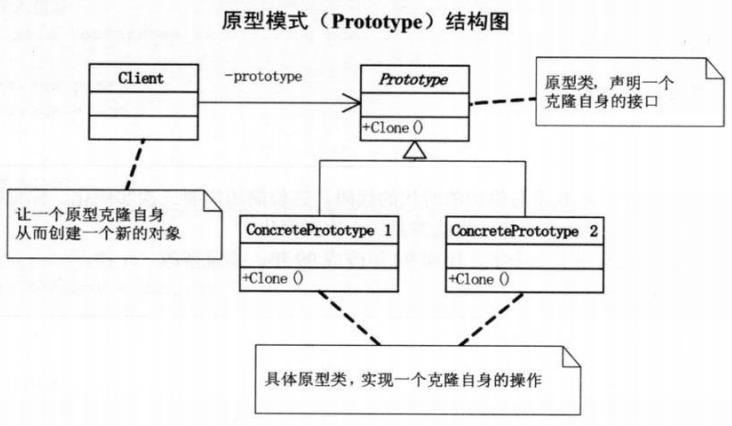
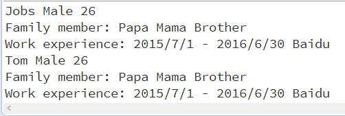
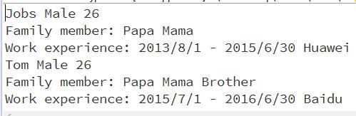

## 一、引言
在开发过程中，有时会遇到为一个类创建多个实例的情况，这些实例内部成员往往完全相同或有细微的差异，而且实例的创建开销比较大或者需要输入较多参数，如果能通过复制一个已创建的对象实例来重复创建多个相同的对象，这就可以大大减少创建对象的开销，这个时候就需要原型模式。

## 二、模式详解

### 1、模式分析
原型模式可以通过一个对象实例确定创建对象的种类，并且通过拷贝创建新的实例。总得来说，原型模式实际上就是从一个对象创建另一个新的对象，使新的对象有具有原对象的特征。
图1给出了原型模式的UML图，可以看出原型模式的结构非常简单。首先，所有可以作为原型的类中都应该有一个用于复制自身的方法clone()，因此，我们可以抽象出一个抽象原型类或接口，该类中只有一个clone()，所有的具体原型类都要实现该方法并定义复制自身的具体行为。在客户端中通过调用具体原型对象的clone方法可以复制原型对象到一个新的对象中。

### 2、具体实现
原型模式是一种应用及其广泛的设计模式，Clone也是一种十分常见的操作，以至于在Java中，终极父类Object将Clone方法作为了所有类应具有的基本功能，并且Java也提供了Cloneable接口（关于Cloneable接口的细节，请看我另一篇博文：JavaSE学习随笔（一） Cloneable接口源码分析与技术细节），这都方便了原型模式的实现。
我们还是以一个例子来说明原型模式的具体实现和作用。考虑一个写简历的场景，简历中包括的信息有姓名、性别、年龄、家庭成员和工作经验几点内容。现在的需求为由于需要向多个公司投递建立简历，因此子创建了一份建立对象之后，还要求能够对已创建的简历进行复制。此时，恰好有几个另外有几个同学也想找工作，为了方便，就把已创建的作为模版，然后根据自身的情况作了一些修改。


// 为了实现上述要求，我们首先定义一个工作经验类，里面有两个成员变量分别为工作时间和公司名称。
class WorkExperience {  
      
    public String timeArea = null;  
    public String company = null;  
         
}/*WorkExperience*/  

// 接着定义一个简历类，该类相当于UML图中的实体原型类，至于抽像原型类或接口，Java中已经我i我们提供了Cloneable接口，因此我们只需要实现它就可以了（实现的方法可以通过上文给// 出的链接到我另一篇博文中查看，在这里我直接给出了接口的实现），我们首先来看一种实现方式。

class Resume implements Cloneable {  
      
    public String name = null;  
    public Integer age = null;  
    public String sex = null;  
    public ArrayList<String> famMem = new ArrayList<>();  
    public WorkExperience work = null;  
      
    public Resume(String name) {  
        this.name = name;  
        work = new WorkExperience();  
    }// Resume  
      
    public void setName(String name) {  
        this.name = name;  
    }// setName  
      
    public void setPersonal(String sex, int age, ArrayList<String> famMem) {  
        this.age = age;  
        this.sex = sex;  
        this.famMem = famMem;  
    }// setPersonal  
  
    public void setWork(String timeArea, String company) {  
        work.timeArea = timeArea;  
        work.company = company;  
    }// setWork  
      
    /** 
     * 重些clone()方法为public类型，并调用Object类的本地clone()方法。 
     */  
    @Override  
    public Resume clone() throws CloneNotSupportedException {  
        return (Resume)super.clone();   
    }// clone  
      
    public void display() {  
        System.out.println(this.name + " " + this.sex + " " + this.age);  
        System.out.print("Family member: ");  
        for(String elem : famMem)  
            System.out.print(elem + " ");  
        System.out.println();  
        System.out.print("Work experience: " + this.work.timeArea);  
        System.out.println(" " + this.work.company);  
    }// display  
      
}/*Resume*/

// 接下来是客户端代码：

public class PrototypeDemo {  
  
    public static void main(String[] args) throws CloneNotSupportedException {  
        ArrayList<String> famMem = new ArrayList<>(); // 家庭成员名单  
        famMem.add("Papa");  
        famMem.add("Mama");  
          
        // 创建初始简历  
        Resume resume1 = new Resume("Jobs", famMem);  
        resume1.setPersonal("Male", 26);  
        resume1.setWork("2013/8/1 - 2015/6/30", "Huawei");  
          
        // 通过简历1复制出简历2，并对家庭成员和工作经验进行修改  
        Resume resume2 = resume1.clone();  
        resume2.setName("Tom");  
        resume2.famMem.add("Brother");  
        resume2.setWork("2015/7/1 - 2016/6/30", "Baidu");  
          
        resume1.display();  
        resume2.display();  
    }// main  
      
}/*Pritotype*/  



运行结果：

从运行结果上看，虽然Tom成功复制了Jobs的简历，但是随后对Tom家庭成员和工作经验的修改却导致了Jobs的简历被同时修改，这是由于我们在实现clone() 方法时直接调用了Object类的本地clone()方法造成的，因为Object的clone()方法执行的是浅拷贝，因而Jobs和Tom的简历中的famMem和work字段都指向了同一个对象实例。要想实现深拷贝，就必须要修改clone()方法（详见：JavaSE学习随笔（一） Cloneable接口源码分析与技术细节）：


class Resume implements Cloneable {  
      
    public String name = null;  
    public int age = 0;  
    public String sex = null;  
    public ArrayList<String> famMem = new ArrayList<>();  
    public WorkExperience work = null;  
      
    public Resume(String name, ArrayList<String> famMem) {  
        this.name = name;  
        this.famMem = famMem;  
        work = new WorkExperience();  
    }// Resume  
      
    public void setName(String name) {  
        this.name = name;  
    }// setName  
      
    public void setPersonal(String sex, int age) {  
        this.age = age;  
        this.sex = sex;  
    }// setPersonal  
  
    public void setWork(String timeArea, String company) {  
        work.timeArea = timeArea;  
        work.company = company;  
    }// setWork  
      
    /** 
     * 重些clone()方法为public类型，为每个字段都创建新的对象，已实现深拷贝功能。 
     */  
    @Override  
    public Resume clone() throws CloneNotSupportedException {  
        int age = this.age;  
        String sex = this.sex;  
        String name = new String(this.name);  
        ArrayList<String> famMem = new ArrayList<>(this.famMem);  
          
        Resume copy = new Resume(name, famMem);   
        copy.setPersonal(sex, age);  
        copy.setWork(this.work.timeArea, this.work.company);  
        return copy;  
    }// clone  
      
    public void display() {  
        System.out.println(this.name + " " + this.sex + " " + this.age);  
        System.out.print("Family member: ");  
        for(String elem : famMem)  
            System.out.print(elem + " ");  
        System.out.println();  
        System.out.print("Work experience: " + this.work.timeArea);  
        System.out.println(" " + this.work.company);  
    }// display  
      
}/*Resume*/ 
 

运行结果：

可以看出，使clone()方法具备深拷贝功能后，复制后的建立与原简历被独立开来。

## 三、总结

原型模式可以说是所有设计模式中最简单的一个，它没有复杂的继承体系，只需要使需要具有拷贝功能的类实现Cloneable接口并重写clone()方法即可。但它的应用却及其广泛，它将对一个对象中各个字段（不管是私有的还是共有的）的复制操作封装在了clone()方法中，这样，使用该类的用户就不需要对对象中的各个字段的细节进行了解，直接调用clone()方法就可以实现对象的拷贝，而且，通过clone()方法还可以为不同的字段设置被复制的权限，从而允许仅对可以被复制的字段进行复制。