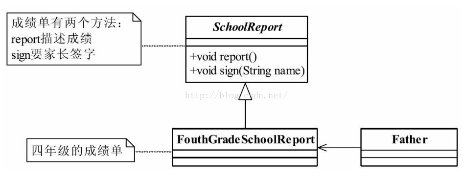
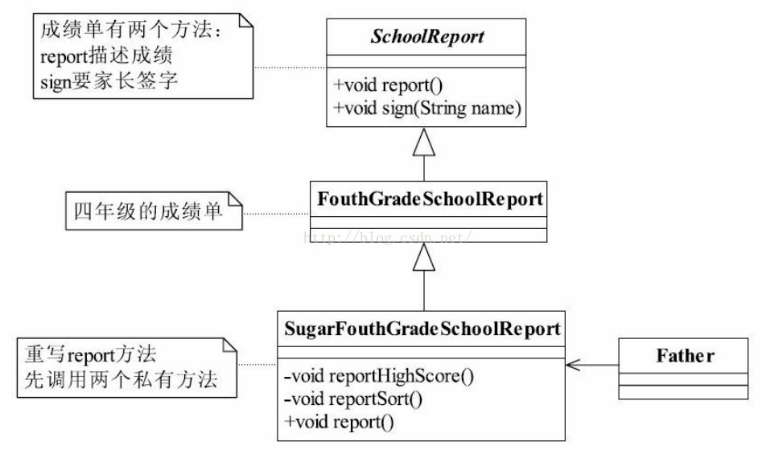
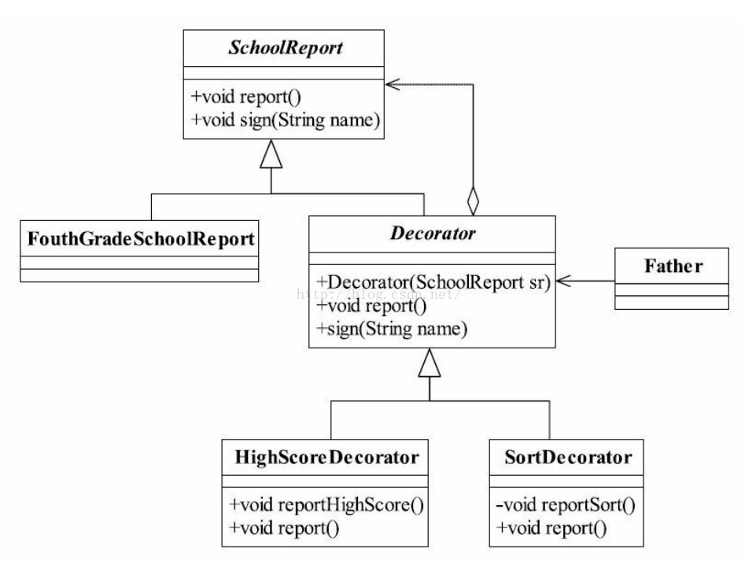
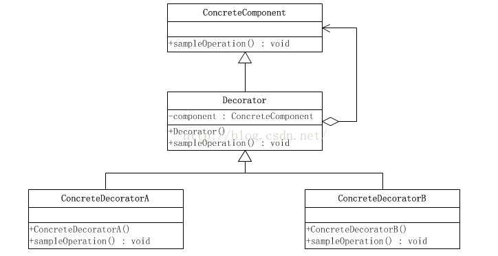
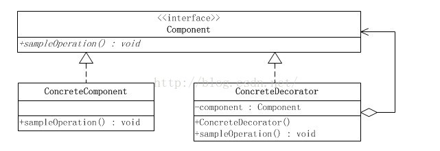
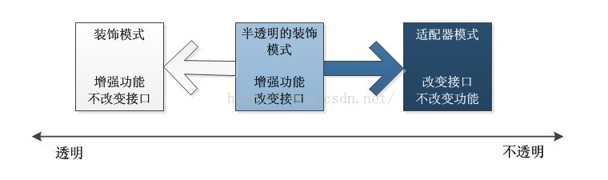

## 1 概述
在一个项目中，你会有非常多的因素考虑不到，特别是业务的变更，不时的冒出一个需求是很正常的情况。有三个继承关系的类：Father、Son、GrandSon，我们要在Son类上增强一些功能怎么办？给Son类增加方法吗？那对GrandSon的影响呢？特别是对GrandSon有多个的情况，你会怎么办？认真看完本文，你会找到你的答案。
JavaIO中，像下面的嵌套语句是不是很常见，为什么要怎样定义呢？理解装饰模式后，你会找到答案。
DataInputStream in = new DataInputStream(new BufferedInputStream(new FileInputStream("FileTest.Java")));

## 2 《设计模式之禅》中的例子
成绩单需要父母签名这事很多人都经历过，这举这样一个例子：

代码清单1 抽象成绩单


//抽象成绩单  
public abstract class SchoolReport {  
    //展示成绩情况  
    public abstract void report();  
    //家长签字  
    public abstract void sign(String name);  
}


代码清单2 四年级成绩单


//四年级成绩单  
public class FouthGradeSchoolReport extends SchoolReport{  
    //我的成绩单  
    public void report(){  
        //成绩单的格式是这个样子的  
        System.out.println("尊敬的XXX家长：");  
        System.out.println("······");  
        System.out.println("语文62 数学65 体育98 自然63");  
        System.out.println("······");  
        System.out.println("      家长签字");  
    }  
    //家长签名  
    public void sign(String name){  
        System.out.println("家长签字为：" + name);  
    }  
}


代码清单3 老爸查看成绩单


//老爸查看成绩单  
public class Father {  
    public static void main(String[] args) {  
        //把成绩单拿过来  
        SchoolReport sr = new FouthGradeSchoolReport();  
        //看成绩单  
        sr.report();  
        //签名？ 休想！  
    }  
}  
/*Output: 
尊敬的XXX家长： 
······ 
语文62 数学65 体育98 自然63 
······ 
      家长签字 
 */  


就这成绩还要我签字？！老爸就开始找扫帚，我开始做准备：深呼吸，绷紧肌肉，提臀，收腹。 哈哈，幸运的是，这个不是当时的真实情况，我没有直接把成绩单交给老爸，而是在交给他之前做了点技术工作，我要把成绩单封装一下，封装分类两步来实现， 如下所示。
● 汇报最高成绩
跟老爸说各个科目的最高分，语文最高是75，数学是78，自然是80，然后老爸觉得我的成绩与最高分数相差不多，考的还是不错的嘛！这个是实情，但是不知道是什么原因，反正期末考试都考得不怎么样，但是基本上都集中在70分以上，我这60多分基本上还是垫底的角色。
● 汇报排名情况
在老爸看完成绩单后，告诉他我在全班排第38名，这个也是实情，为啥呢？有将近十个同学退学了！ 这个情况我是不会说的。 不知道是不是当时第一次发成绩单时学校没有考虑清楚，没有写上总共有多少同学，排第几名，反正是被我钻了个空子。
那修饰是说完了，我们看看类图如何修改，如下图所示：

代码清单4 修饰成绩单


//修饰成绩单  
public class SugarFouthGradeSchoolReport extends FouthGradeSchoolReport {  
    // 首先要定义你要美化的方法， 先给老爸说学校最高成绩  
    private void reportHighScore() {  
        System.out.println("这次考试语文最高是75， 数学是78， 自然是80");  
    }// 在老爸看完毕成绩单后，我再汇报学校的排名情况  
  
    private void reportSort() {  
        System.out.println("我是排名第38名...");  
    }// 由于汇报的内容已经发生变更，那所以要重写父类  
  
    @Override  
    public void report() {  
        this.reportHighScore(); // 先说最高成绩  
        super.report(); // 然后老爸看成绩单  
        this.reportSort(); // 然后告诉老爸学习学校排名  
    }  
}  


代码清单5 老爸查看修饰后的成绩单


public class Father2 {  
    public static void main(String[] args) {  
        // 把美化过的成绩单拿过来  
        SchoolReport sr = new SugarFouthGradeSchoolReport();  
        // 看成绩单  
        sr.report();  
        // 然后老爸， 一看， 很开心， 就签名了  
        sr.sign("老三"); // 我叫小三， 老爸当然叫老三  
    }  
}  
/* 
这次考试语文最高是75， 数学是78， 自然是80 
尊敬的XXX家长： 
······ 
语文62 数学65 体育98 自然63 
······ 
      家长签字 
我是排名第38名... 
家长签字为：老三 
 * */ 


通过继承确实能够解决这个问题，老爸看成绩单很开心，然后就给签字了，但现实的情况是很复杂的，可能老爸听我汇报最高成绩后，就直接乐开花了，直接签名了，后面的排名就没必要看了，或者老爸要先看排名情况，那怎么办？ 继续扩展？你能扩展多少个类？这还是一个比较简单的场景，一旦需要装饰的条件非常多，比如20个，你还通过继承来解决，你想象的子类有多少个？ 你是不是马上就要崩溃了！
好，你也看到通过继承情况确实出现了问题，类爆炸，类的数量激增，光写这些类不累死你才怪，而且还要想想以后维护怎么办，谁愿意接收这么一大摊本质相似的代码维护工作？并且在面向对象的设计中，如果超过两层继承，你就应该想想是不是出设计问题了，是不是应该重新找一条康庄大道了，这是经验值，不是什么绝对的，继承层次越多以后的维护成本越多，问题这么多，那怎么办？好办，我们定义一批专门负责装饰的类，然后根据实际情况来决定是否需要进行装饰，类图稍做修正，如图17-4所示。

增加一个抽象类和两个实现类，其中Decorator的作用是封装SchoolReport类，如果大家还记得代理模式，那么很容易看懂这个类图，装饰类的作用也就是一个特殊的代理类，真实的执行者还是被代理的角色FouthGradeSchoolReport。


/**
 * 抽象类，也是最核心的顶层对象
 */
public abstract class SchoolReport {
    // 报告成绩
    public abstract void report();

    // 家长签字
    public abstract void sign(String name);

}



/**
 * 最核心、最原始、最基本的接口或抽象类的实现，你要装饰的就是它
 */
public class ConcreateSchoolReport extends SchoolReport {

    @Override
    public void report() {
        System.out.println("报告家长，您的孩子成绩不及格");
    }

    @Override
    public void sign(String name) {
        System.out.println("家长签名：" + name);
    }
}



/**
 * 装饰的抽象类，这是一个特殊的代理类（代理模式），具体执行的方法还是由传入进来的SchoolReport(具体实现类)决定
 */
public abstract class Decorator extends SchoolReport {

    private SchoolReport schoolReport;

    // 构造函数，传递SchoolReport对象并保存在私有属性中
    public Decorator(SchoolReport schoolReport){
        this.schoolReport = schoolReport;
    }

    // 具体执行的report方法由传进来的SchoolReport决定
    public void report() {
        this.schoolReport.report();
    }

    public void sign(String name) {
        this.schoolReport.sign(name);
    }
}



/**
 * 具体的装饰类，就是由他进行对象的装饰
 */
public class HighScoreDecorator extends Decorator {

    // 由于父类显示的定义了构造方法，这里也必须显示定义
    public HighScoreDecorator(SchoolReport schoolReport) {
        super(schoolReport);
    }

    // 自定义的修饰方法，此方法用于修饰具体的SchoolReport对象ConcreateSchoolReport
    public void highCore(){
        System.out.println("其实大家都不及格，你儿子分算高的");
    }

    //重写report方法，将自定义方法放在父类的report方法执行之前执行，用于修饰
    @Override
    public void report() {
        highCore();
        super.report();
    }

}

public class OrderSchoolReport extends Decorator {

    // 由于父类显示的定义了构造方法，这里也必须显示定义
    public OrderSchoolReport(SchoolReport schoolReport) {
        super(schoolReport);
    }

    // 自定义的修饰方法，此方法用于修饰具体的SchoolReport对象ConcreateSchoolReport
    public void order(){
        System.out.println("而且你儿子的分数排名全班第一");
    }

    //重写report方法，将自定义方法放在父类的report方法执行之前执行，用于修饰
    @Override
    public void report() {
        order();
        super.report();
    }
}



/**
 * 客户端调用
 */
public class Client {

    public static void main(String[] args) {
        SchoolReport report = new ConcreateSchoolReport();
        report = new HighScoreDecorator(report);
        report = new OrderSchoolReport(report);
        report.report();
        report.sign("NB");
    }

}


## 3 装饰模式的定义
装饰模式（Decorator Pattern）是一种比较常见的模式，其定义如下：Attach additionalresponsibilities to an object dynamically keeping the same interface.Decoratorsprovide a flexible alternative to subclassing for extending functionality.（ 动态地给一个对象添加一些额外的职责。就增加功能来说，装饰模式相比生成子类更为灵活。）
装饰模式的通用类图如图5所示。

在类图中，有四个角色需要说明：
**● Component抽象构件**
Component是一个接口或者是抽象类，就是定义我们最核心的对象，也就是最原始的对象，如上面的成绩单。
注意 在装饰模式中，必然有一个最基本、最核心、最原始的接口或抽象类充当Component抽象构件。
**● ConcreteComponent 具体构件**
ConcreteComponent是最核心、最原始、最基本的接口或抽象类的实现，你要装饰的就是它。
**● Decorator装饰角色**
一般是一个抽象类，做什么用呢？实现接口或者抽象方法，它里面可不一定有抽象的方法呀，在它的属性里必然有一个private变量指向Component抽象构件。
**● 具体装饰角色**
ConcreteDecoratorA和ConcreteDecoratorB是两个具体的装饰类，你要把你最核心的、最原始的、最基本的东西装饰成其他东西，上面的例子就是把一个比较平庸的成绩单装饰成家长认可的成绩单。

理解client中的new


public class Client {

    public static void main(String[] args) {
        //这里创建了一个ConcreateComponent对象，返回对象的引用component
        Component component = new ConcreateComponent();

        //这里将上述对象传入ConcreateDecoratorA中，通过其构造方法将component传入到Decorato中
        //对象：一个Decorato对象，其中私有属性component保存为ConcreateComponent
        //     一个ConcreateDecoratorA对象component
        component = new ConcreateDecoratorA(component);

        //这里将ConcreateDecoratorA传入ConcreateDecoratorB中，通过其构造方法将其传入到Decorato中
        //对象：一个Decorato对象，其中私有属性component保存为ConcreateDecoratorA
        //     一个ConcreateDecoratorB对象component
        component = new ConcreateDecoratorB(component);

        //先执行ConcreateDecoratorB中的operate方法，再执行其父类Decorato中的operate，注意此时的Decorato方法operate会调用ConcreateDecoratorA中的operate，
        //该方法又会调用ConcreateComponent中的operate方法，故只需要在ConcreateDecoratorA、B两个修饰类的operate中加上具体修饰的方法即可完成链式的调用
        component.operate();
    }

}


## 4 半透明的装饰模式
### 4.1 装饰模式的简化
如果只有一个ConcreteComponent类，那么可以考虑去掉抽象的Component类（接口），把Decorator作为一个ConcreteComponent子类。如下图所示：

如果只有一个ConcreteDecorator类，那么就没有必要建立一个单独的Decorator类，而可以把Decorator和ConcreteDecorator的责任合并成一个类。甚至在只有两个ConcreteDecorator类的情况下，都可以这样做。如下图所示

### 4.2 透明性的要求
装饰模式对客户端的透明性要求程序不要声明一个ConcreteComponent类型的变量，而应当声明一个Component类型的变量。
用上面成绩单的例子来说有：
SchoolReport sr;
sr = new FouthGradeSchoolReport();
sr = new HighScoreDecorator(sr);
sr = new SortDecorator(sr);
而下面的做法是不对的：
HighScoreDecorator hd = new HighScoreDecorator(sr);
SortDecorator sd = new SortDecorator(sr);

### 4.3 半透明的装饰模式
然而，纯粹的装饰模式很难找到。装饰模式的用意是在不改变接口的前提下，增强所考虑的类的性能。在增强性能的时候，往往需要建立新的公开的方法。上面成绩单的例子中，显示前十名学生信息。这就意味着SortDecorator类中应当有一个新的displayTopTen()方法。再比如，显示显示各科最高分学生信息，这就意味着在HighScoreDecorator类里应当有一个新的showTop()方法。
这就导致了大多数的装饰模式的实现都是“半透明”的，而不是完全透明的。换言之，允许装饰模式改变接口，增加新的方法。这意味着客户端可以声明ConcreteDecorator类型的变量，从而可以调用ConcreteDecorator类中才有的方法：
SchoolReport sr = new SortDecorator();
SortDecorator sd = new SortDecorator();
sd.displayTopTen();
半透明的装饰模式是介于装饰模式和适配器模式之间的。适配器模式的用意是改变所考虑的类的接口，也可以通过改写一个或几个方法，或增加新的方法来增强或改变所考虑的类的功能。大多数的装饰模式实际上是半透明的装饰模式，这样的装饰模式也称做半装饰、半适配器模式。
装饰模式和适配器模式都是“包装模式(Wrapper Pattern)”，它们都是通过封装其他对象达到设计的目的的，但是它们的形态有很大区别。
理想的装饰模式在对被装饰对象进行功能增强的同时，要求具体构件角色、装饰角色的接口与抽象构件角色的接口完全一致。而适配器模式则不然，一般而言，适配器模式并不要求对源对象的功能进行增强，但是会改变源对象的接口，以便和目标接口相符合。
装饰模式有透明和半透明两种，这两种的区别就在于装饰角色的接口与抽象构件角色的接口是否完全一致。透明的装饰模式也就是理想的装饰模式，要求具体构件角色、装饰角色的接口与抽象构件角色的接口完全一致。相反，如果装饰角色的接口与抽象构件角色接口不一致，也就是说装饰角色的接口比抽象构件角色的接口宽的话，装饰角色实际上已经成了一个适配器角色，这种装饰模式也是可以接受的，称为“半透明”的装饰模式，如下图所示。

在适配器模式里面，适配器类的接口通常会与目标类的接口重叠，但往往并不完全相同。换言之，适配器类的接口会比被装饰的目标类接口宽。
显然，半透明的装饰模式实际上就是处于适配器模式与装饰模式之间的灰色地带。如果将装饰模式与适配器模式合并成为一个“包装模式”的话，那么半透明的装饰模式倒可以成为这种合并后的“包装模式”的代表。

## 5 装饰模式应用
### 5.1 装饰模式的优点
* 装饰类和被装饰类可以独立发展，而不会相互耦合。换句话说，Component类无须知道Decorator类，Decorator类是从外部来扩展Component类的功能，而Decorator也不用知道具体的构件。
* 装饰模式是继承关系的一个替代方案。我们看装饰类Decorator，不管装饰多少层，返回的对象还是Component，实现的还是is-a的关系。
* 装饰模式与继承关系的目的都是要扩展对象的功能，但是装饰模式可以提供比继承更多的灵活性。装饰模式允许系统动态决定“贴上”一个需要的“装饰”，或者除掉一个不需要的“装饰”。继承关系则不同，继承关系是静态的，它在系统运行前就决定了。
* 过使用不同的具体装饰类以及这些装饰类的排列组合，设计师可以创造出很多不同行为的组合。
### 5.2 装饰模式的缺点
* 由于使用装饰模式，可以比使用继承关系需要较少数目的类。使用较少的类，当然使设计比较易于进行。但是，在另一方面，使用装饰模式会产生比使用继承关系更多的对象。更多的对象会使得查错变得困难，特别是这些对象看上去都很相像。
* 多层的装饰是比较复杂的。
### 5.3 装饰模式的使用场景
* 需要扩展一个类的功能，或给一个类增加附加功能。
* 需要动态地给一个对象增加功能，这些功能可以再动态地撤销。
* 需要为一批的兄弟类进行改装或加装功能，当然是首选装饰模式。
* 装饰模式在Java语言中的最著名的应用：Java I/O标准库的设计了

